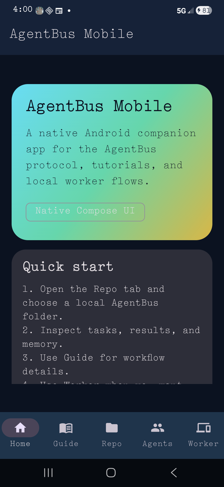
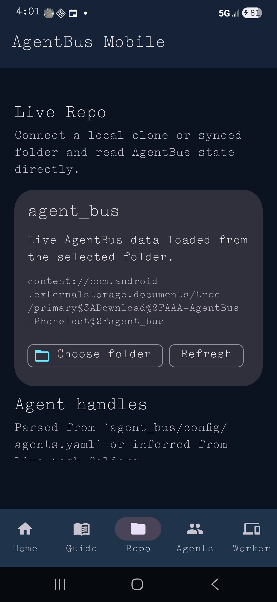
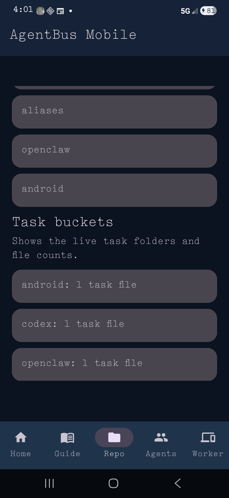
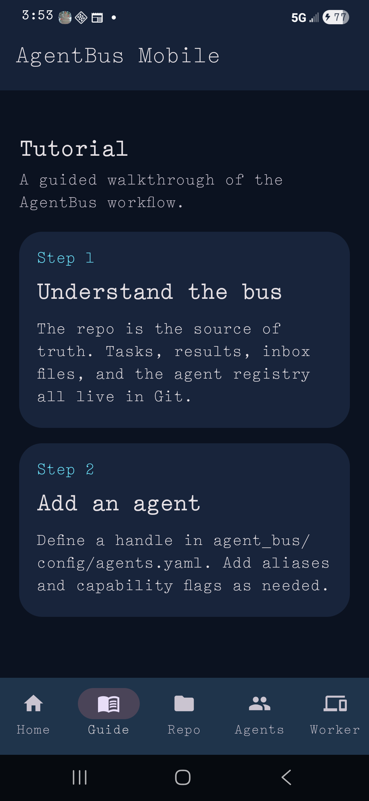

# AgentBus Mobile

This is the native Android companion app scaffold for AgentBus.

It is intentionally lightweight:

- Jetpack Compose UI
- built-in tutorial screens
- agent registry overview
- live repository browser for a selected `agent_bus/` folder tree
- indexed memory context from `agent_bus/memory/index/memory-index.json`
- live memory note search and write-back
- load an indexed note into the editor and update it in place
- inspect note provenance and body preview for the selected memory entry
- first-run onboarding that points new users to Repo, Guide, and Worker
- local worker guidance for desktop and Android/Termux flows

## Open and build

Open `android-app/` in Android Studio as a Gradle project.

This scaffold now includes a Gradle wrapper, so you can build from the command line too.

From there you can:

- sync the project
- run it on an emulator or device
- build a debug APK
- later sign and release a production APK

## Build commands

From the repo root:

- debug APK: `cd android-app && .\gradlew.bat assembleDebug`
- release APK: `cd android-app && .\gradlew.bat assembleRelease`

Release builds require a local `android-app/signing.properties` file and a keystore. Copy `signing.properties.example` first, then fill in the values.

For GitHub release automation, set the repository secrets `ANDROID_KEYSTORE_B64`, `ANDROID_KEYSTORE_PASSWORD`, `ANDROID_KEY_ALIAS`, and `ANDROID_KEY_PASSWORD`.

## One-command deploy

Use `scripts/android_install.ps1` to build, install, and optionally launch the app on a connected device.

## Release verification

Use `scripts/verify_android_release.ps1` to generate a temporary signing key, build `assembleRelease`, and verify the APK signature locally.

The script cleans up the temporary keystore and `android-app/signing.properties` after it finishes, so it is safe to run without affecting your real release signing material.

## Screenshots

These captures were taken on a Samsung Galaxy S24 Ultra during the final validation pass:

## What this app is for

- understanding the AgentBus protocol visually
- reviewing agents, routes, worker modes, and memory context
- searching and writing memory notes directly into the selected repo tree
- getting a guided first-run path before you explore the app
- giving you a guided mobile front end for the same repo-backed system

## What it is not

- it is not a heavy backend
- it is not a replacement for the repo source of truth
- it is not a standalone data store

## Tutorial

See [TUTORIAL.md](TUTORIAL.md) for a more detailed walkthrough.

## License

The Android companion app is part of the main AgentBus project and is covered by the project [Apache 2.0 license](../LICENSE).
